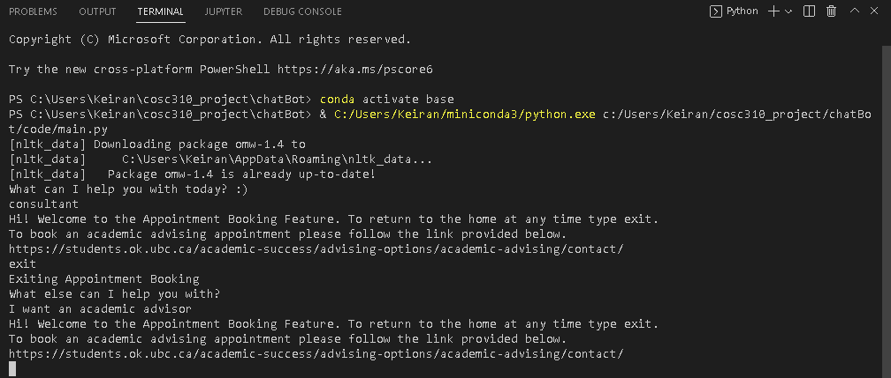
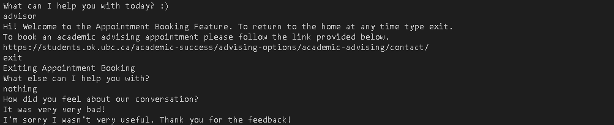
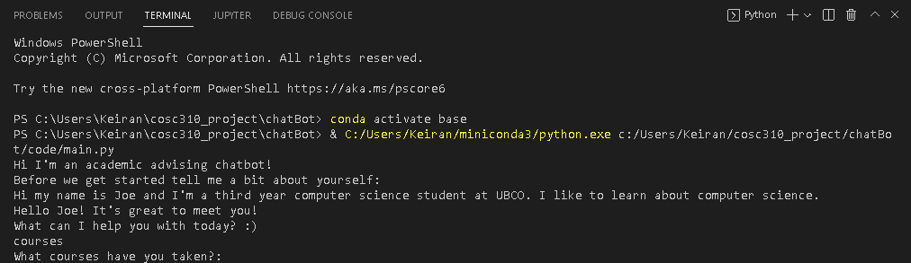
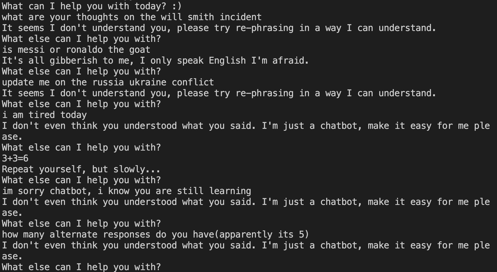
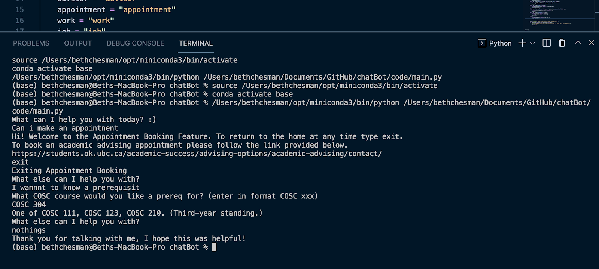
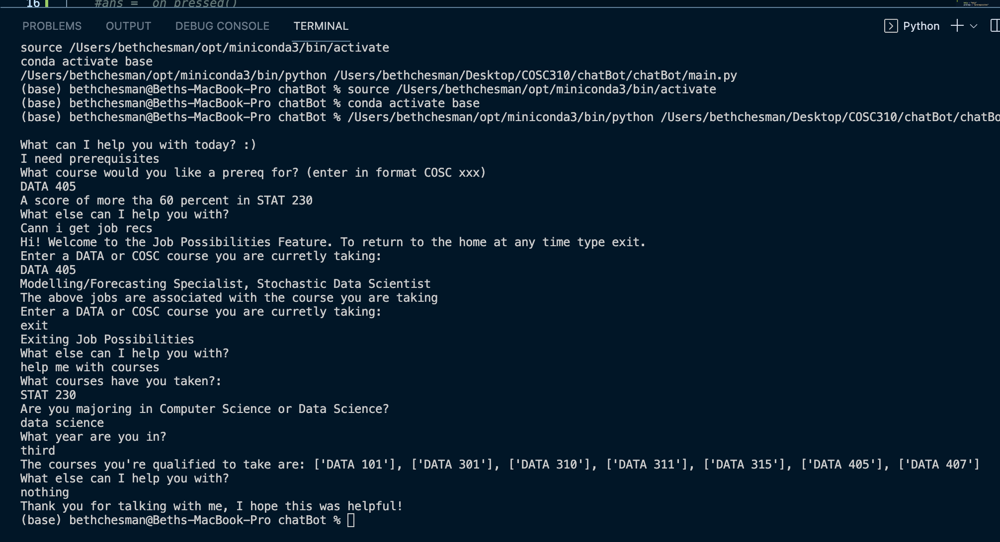
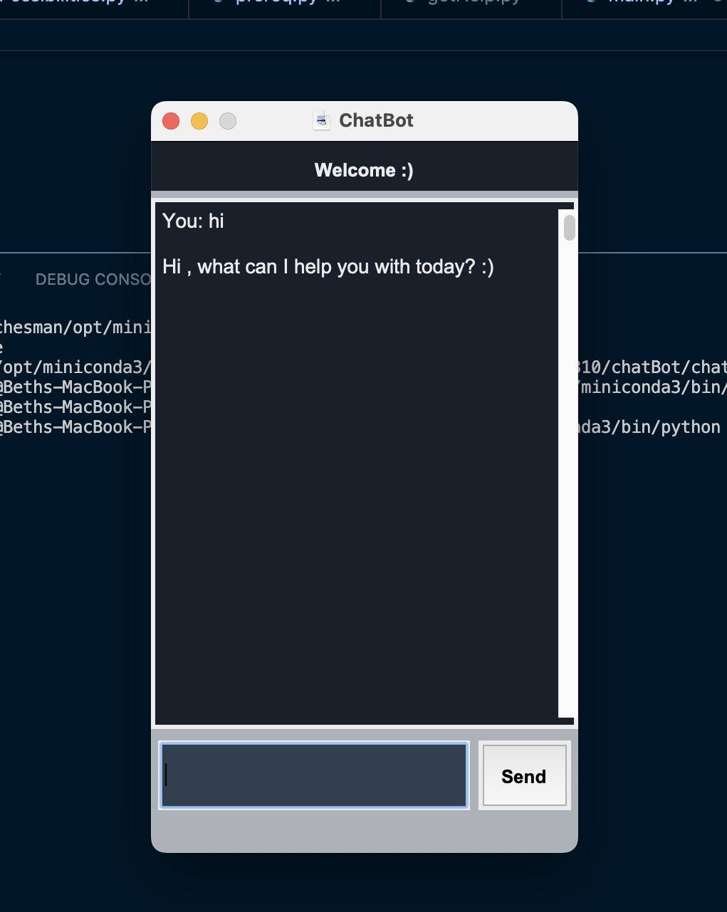

# UBCO Computer Science ChatBot

Our chatBot is an academic tool for UBCO COSC students to aid them in the mundane tasks that come with course selection, scheduling, and acedmic advising!

The code for chatBot consists of 7 classes that are all run within our main class. The main class communicates with the user and decides which class to run based on their inputs. Since each class represents one of the bot's functions, it simplifies the process considering an entire function can be enclosed in a single class. After the functions isn't needed by the user, the program takes them back to the main method and aks if any other assistance is needed. Using a while loop, the main method will run until the user has specified no more help is needed. This loop lets the user take advantage of all the functions in one conversation.

| Class | Description |
| ----------- | ----------- |
| main | Begins conversation with user, runs fuction class based on user input and continues until user no longer requires its assistance |
| getHelp | Logs user issues it found within the chatBot, storing them in a csv file, and gives user pointers on how to communicate with the bot.  |
| coursesAvail | Asks user what courses they've taken and outputs the courses the user has completed the prerequisites for. |
| prereq | Prompts user to enter a COSC course that they would like to know the prerequisities for, and validates their input to ensure it is correct |
| jobPossibilities | Asks user what course COSC course they are taking and returns potential jobs associated with that course |
| bookingAppointment | Allows users to book academic advising appointments by providing the URL to the UBCO academic advising website | 
| coursestats | Allows users to view historical course informaton regarding the grades of them by providing the URL to the ubcGrades website | 

New features for Assignment 3:

Synonym Recognition:
The chatbot is now able to recognise common synonyms of words used for other features in the main class. This improves our chatBot because the user no longer needs to enter one specific word to use a feature. Now the user can use multiple similar words to use the same feature. 

Sample Output:

Sentiment Analysis:
The chatbot can now recognise when the user is negative language which might indicate the user is feeling frustrated with the chatbot. The chatbot can then ask the user if they would like to continue using the chatbot or not. Additionally, this feature also allows the chatbot to ask the user how they felt about the conversation and react according to how positive or negative the users response was.

Sample Output:

Named entity recognition:
This feature allows the chatbot to recognise the users name once the user introduces themselves. Then the chatbot can use the users name when talking to them to give the program a more personable feel. 

Sample Output:

5 output responses:
This feature allows the bot to appear more "real", by alternating through a list of alternate, appropriate responses for when the user enters something that the bot can not understand. The bot requires the user to re-enter what they typed in a format that is understandable, and the multiple ways of asking for this, especially in a humourous way, should add to the user experience.

Sample output:

Porter Stemmer Algorithm:
The chatbot can now take minor spellinng errors in inputs and still get the user to their proper destinationn within the system. With the porter stemmer algorithm, the chatbot will find the root of a word beinng inputed, regardless of plurals, and identify possible versions of this word the user is trying to use.

Sample Outout:

New Topic:
Chatbot is no longer just for computer science students! It nnow can perform all the same features for data sceince students as well. Including, providing prerequisites and job possibilities.

Sample Output:

New Feature:
Here is the gui added to the chatBot. It’s similar to most text message/chat interfaces, so its easy and familiar to users.

Sample Output:

